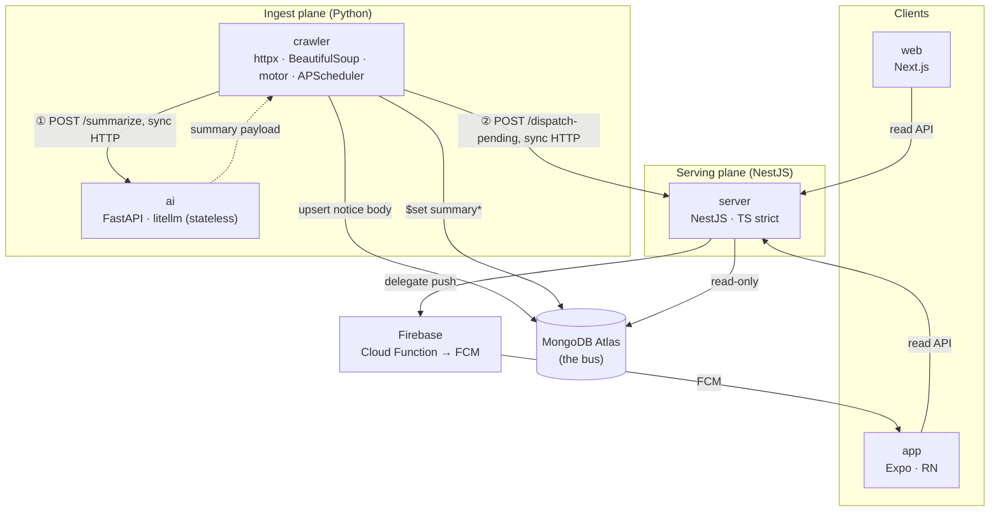
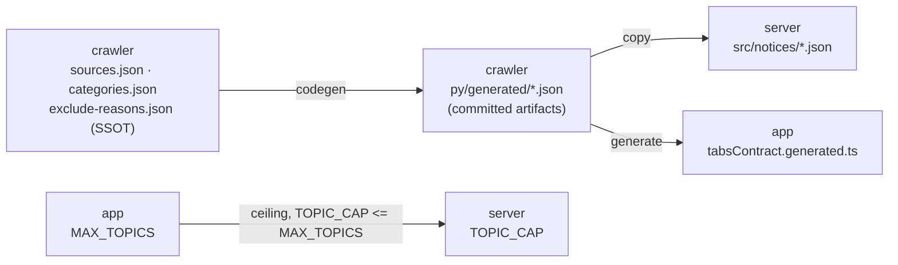

# Container View

> Inside the system: how the repositories, MongoDB and Firebase interlock (C4 Level 2). One level out is [System Context](system-context.md), and this same picture in motion is [Notice Pipeline](../flows/notice-pipeline.md).

## The core idea: DB-as-bus, two planes

There is no message queue. A single MongoDB Atlas acts as the bus, with only two synchronous HTTP seams on top of it.

- **Ingest plane (Python)**: the crawler collects and cleans notice bodies into Mongo, and delegates summarization to a stateless AI service whose output it writes back onto the same document.
- **Serving plane (NestJS)**: the server reads Mongo and serves the API, orchestrating push dispatch without sending anything itself (delivery is delegated to a Firebase Cloud Function).

The planes never call each other directly. They meet asynchronously through Mongo. At runtime, synchronous HTTP happens in only two places: crawler → AI, and crawler → server.

A third coupling between these repos is easy to miss, because it moves no packets at runtime. That one is shared configuration, covered in [Config seam](#the-third-seam-config-at-build-time) below.

## Diagram

## Responsibility and ownership

| Container | Responsibility | Mongo relationship | Docs |
| --- | --- | --- | --- |
| crawler | Crawl, clean, orchestrate summarization. **Owns the documents and unique indexes** for `notices` and `schedule` | primary writer | [crawler docs](https://github.com/spencer0124/skkuverse-crawler/tree/main/docs) |
| ai | Notice body → structured summary. **Stateless, no DB access** | none | [ai docs](https://github.com/spencer0124/skkuverse-ai/tree/main/docs) |
| server | Read API + push dispatch. **Never writes `summary*`; owns exactly one read index** | read-only (+ 1 read index) | [server docs](https://github.com/spencer0124/skkuverse-server/tree/main/docs) |
| app | Server-driven tabs, Markdown rendering, push receipt | none (via API) | [app docs](https://github.com/spencer0124/skkuverse-app/tree/main/docs) |
| web | Marketing site | none | (pending) |
| **this repo** | Cross-repo docs, shared conventions, the config-contract registry, and the daily fleet pin. `exported/sync_contracts.py` and `exported/lint_conventions.py` both run as blocking gates in consumer CI | none | [contracts/README.md](../../contracts/README.md) |

## The two runtime HTTP seams

- **① crawler → ai** (`POST /api/notices/summarize`): inside the Docker network, unauthenticated (isolation is the network's job). The only path by which a summary gets attached.
- **② crawler → server** (`POST /internal/notices/dispatch-pending`): a fire-and-forget ping at the end of each cycle, authenticated with `X-Internal-Token`. A server-side cron sweep runs in parallel as a safety net.

## The third seam: config at build time

Some configuration is owned by one repo and vendored by others. It moves no packets at runtime, so it does not appear in the diagram above — but it is a real dependency edge, and for years it was the least visible one in the system.

Properties worth noting:

- **It happens at build time.** Every consumer reads its own vendored copy from disk at boot, and nothing fetches across repos while serving.
- **One edge runs app → server**, the opposite direction from every arrow in the runtime diagram. `MAX_TOPICS` in the Cloud Function is the ceiling the server's `TOPIC_CAP` must stay under, because the function rejects any payload above it.
- **There is a CI-time network edge too.** Each consumer repo clones this repository during CI to fetch the contract tool. The crawler is a producer and has nothing to verify, so it does not. That makes this repo a build dependency of the fleet, and its own tests gate every change to it.

Every edge above is declared in [`contracts/manifest.json`](../../contracts/manifest.json), pinned by content hash in each consumer's `.contracts.lock.json`, and enforced offline in CI. The rationale for the pull-based design is [ADR 0002](../decisions/0002-pull-based-config-contracts.md).

## The fourth seam: a daily pin of the whole fleet

The first three seams are how the repos *affect* each other. This one is how the system *records itself*.

Once a day a scheduled workflow in this repository pins every repo's `main` as a git submodule at the repository root and commits, so this repository's history becomes a day-by-day record of what the whole system was. It is the only edge that touches all six repos, the only purely observational one, and the only one with no credential in either direction — a direct extension of ADR 0002's property that no cross-repo PAT exists anywhere here.

Two distinctions are worth holding onto, because both are easy to get backwards:

- **`.gitmodules` and `contracts/manifest.json` answer different questions.** The manifest declares the repos that exchange configuration. `.gitmodules` declares the repos that belong to SKKUverse, deliberately a superset, and neither is derived from the other.
- **A pin records where `main` pointed. `check --fleet` reads where it points now.** `sync_contracts.py check --fleet` queries every repo's live `main` over the network, so the two disagree whenever anyone has pushed since the last snapshot. That disagreement is expected rather than drift.

It has to be recorded as it happens, because git cannot reconstruct it afterwards. [ADR 0003](../decisions/0003-daily-fleet-pin-as-submodules.md) works through why.

## Related

- [Notice Pipeline](../flows/notice-pipeline.md) — the dynamic sequence of this picture
- [Data Topology](data-topology.md) — collection ownership on the bus
- [Config Contracts](../../contracts/README.md) — the config seam in operational detail
- [ADR 0001 — Notice data ownership](../decisions/0001-notice-data-ownership.md)
- [ADR 0002 — Pull-based config contracts](../decisions/0002-pull-based-config-contracts.md)
- [ADR 0003 — Daily fleet pin as submodules](../decisions/0003-daily-fleet-pin-as-submodules.md)
