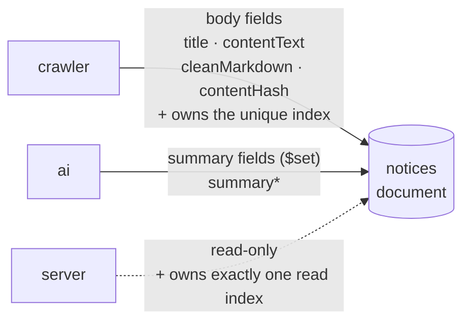

# Data Topology

> The single map of which repo owns which data and where its schema is documented. **This document never duplicates schema fields** — it links to the owning repo's canonical document.

Scope: **runtime data** (MongoDB collections). Cross-repo ownership of **configuration files** has its own map, and that one is machine-readable rather than prose — [`contracts/manifest.json`](../../contracts/manifest.json), explained in [`contracts/README.md`](../../contracts/README.md). Both maps follow the same rule: the producer owns it, consumers hold copies.

## The ownership rule

> [!NOTE]
> **A collection's schema document is owned by the repo that writes or migrates it** (database-per-service). Read-only repos document their own perspective — read indexes, render contracts — and link to the owner for field definitions.

MongoDB Atlas holds several logical databases. Most have a single owner; the one exception is `skku_notices.notices`, which has multiple writers.

## Collection ownership map

| Database | Collection | Owner (writer) | Other access | Canonical schema doc |
| --- | --- | --- | --- | --- |
| `skku_notices` | `notices` | **crawler** (documents + unique index) | ai (`summary*` via `$set`), server (read + one read index) | [crawler `docs/notice-schema.md`](https://github.com/spencer0124/skkuverse-crawler/blob/main/docs/notice-schema.md) |
| `skku_notices` | `schedule` | **crawler** | — | [crawler docs](https://github.com/spencer0124/skkuverse-crawler/tree/main/docs) *(no dedicated schema doc yet)* |
| `skku_notices` | `restaurant` *(planned)* | **crawler** | — | crawler, once the restaurant module lands |
| `bus_campus` | `bus_schedules`, `bus_overrides` | **server** | — | [server docs](https://github.com/spencer0124/skkuverse-server/tree/main/docs) |
| `skkubus_ads` | `ad_events` and others | **server** | — | [server docs](https://github.com/spencer0124/skkuverse-server/tree/main/docs) |

> Database names vary by environment (`_dev` / `_test` suffixes). The SSOT for that rule is the crawler's `shared/config.py` and the server's config module. The values are not restated here.

## `notices` — splitting ownership across writers

This is the only collection three repos touch. Field ownership is split cleanly:

- **crawler** creates the document and owns the `(articleNo, sourceId)` unique compound index. Cleaning (sanitize, markdown) is also its job.
- **ai** contributes only the `summary*` fields. It never connects to the database — the crawler writes on its behalf, which is what keeps it stateless.
- **server** never writes. It guarantees one read index idempotently in `onModuleInit`, and nothing else.

The reasoning and the invariants are in [ADR 0001](../decisions/0001-notice-data-ownership.md).

## Why there is no separate "database docs" repo

Collecting every schema in one place would (a) blur ownership and (b) split code and documentation across two repos, where they drift. Instead **schemas live with their owner and this document is only the map** — the system-level application of *point at the source, don't copy the value*.

## Related

- [Container View](container-view.md) — how the containers sit around the bus
- [Notice Pipeline](../flows/notice-pipeline.md) — the order in which these fields are written and read
- [Config Contracts](../../contracts/README.md) — the same ownership idea, applied to configuration files
