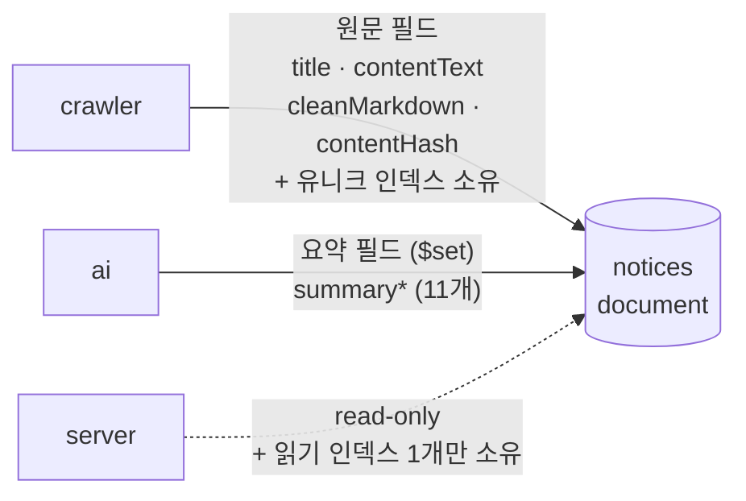

# Data Topology

> "어느 데이터가 어느 레포 소유이고, 그 스키마는 어디에 문서화돼 있나"의 단일 지도. **이 문서는 스키마 필드를 복제하지 않는다** — 소유 레포의 canonical 문서를 링크만 한다.

> [!NOTE]
> 이건 **런타임 데이터**(MongoDB 컬렉션)의 소유권 맵이다. **설정 파일**의 크로스 레포 소유권은
> 별도의 지도가 있고, 그쪽은 산문이 아니라 기계 판독 가능한 레지스트리다 —
> [`contracts/manifest.json`](../../contracts/manifest.json) + [`contracts/README.md`](../../contracts/README.md).
> 두 지도의 규칙은 같다: 생산자가 소유하고, 소비자는 사본을 든다.

## 소유 규칙

> [!NOTE]
> **컬렉션 스키마 문서는 그것을 쓰거나 마이그레이션하는 레포가 소유한다** (database-per-service 원칙). 읽기만 하는 레포는 자기 관점(읽기 인덱스 등)만 문서화하고, 필드 정의는 소유 레포를 링크한다.

MongoDB Atlas는 여러 논리 DB를 담는다. 대부분 단일 소유이고, 예외는 `skku_notices.notices` 하나 — 여기만 writer가 복수다.

## 컬렉션 소유권 맵

| Database | Collection | 소유 (writer) | 그 외 접근 | Canonical 스키마 문서 |
| --- | --- | --- | --- | --- |
| `skku_notices` | `notices` | **crawler** (문서 + 유니크 인덱스) | ai (`summary*` `$set`), server (read + 읽기 인덱스 1개) | [crawler `reference/schema/notices.md`](https://github.com/spencer0124/skkuverse-crawler/tree/main/docs) |
| `skku_notices` | `schedule` | **crawler** | — | [crawler `reference/schema/schedule.md`](https://github.com/spencer0124/skkuverse-crawler/tree/main/docs) |
| `skku_notices` | `restaurant` *(예정)* | **crawler** | — | crawler (식당 모듈 착지 시) |
| `bus_campus` | `bus_schedules`, `bus_overrides` | **server** | — | [server docs](https://github.com/spencer0124/skkuverse-server/tree/main/docs) |
| `skkubus_ads` | `ad_events` 등 | **server** | — | [server docs](https://github.com/spencer0124/skkuverse-server/tree/main/docs) |

> DB 이름은 환경별로 갈린다 (`_dev`/`_test` 접미사). 규칙의 SSOT는 crawler `shared/config.py` / server 설정. 여기 값을 박제하지 않는다.

## `notices` 컬렉션 — 복수 writer의 소유 분할

이 컬렉션만 예외적으로 세 레포가 손댄다. 필드 소유가 명확히 갈린다:

- **crawler**: 문서를 만들고 `(articleNo, sourceId)` 유니크 복합 인덱스를 소유. 정제(sanitize/markdown)도 크롤러 몫.
- **ai**: 요약 필드(`summary*`)만 `$set`. DB에 직접 붙지 않고 크롤러가 대신 쓴다 — ai는 stateless.
- **server**: 절대 쓰지 않는다. 읽기용 인덱스 하나만 `onModuleInit`에서 idempotent 보장.

이 소유 분할의 근거와 불변식은 [ADR 0001 — 공지 데이터 소유권](../decisions/0001-notice-data-ownership.md).

## 왜 "DB 문서 레포"를 따로 두지 않았나

한 곳에 모든 스키마를 모으면 (a) 소유가 흐려지고 (b) 코드와 문서가 두 레포로 갈라져 drift가 난다. 대신 **스키마는 소유 레포에, 이 문서는 지도만** — "값을 복사하지 말고 출처를 가리켜라" 규칙의 시스템 레벨 적용이다.

## 관련 문서

- [컨테이너 뷰](container-view.md) — 버스(Mongo) 위 컨테이너 배치
- [공지 파이프라인](../flows/notice-pipeline.md) — 필드가 쓰이고 읽히는 시간 순서
