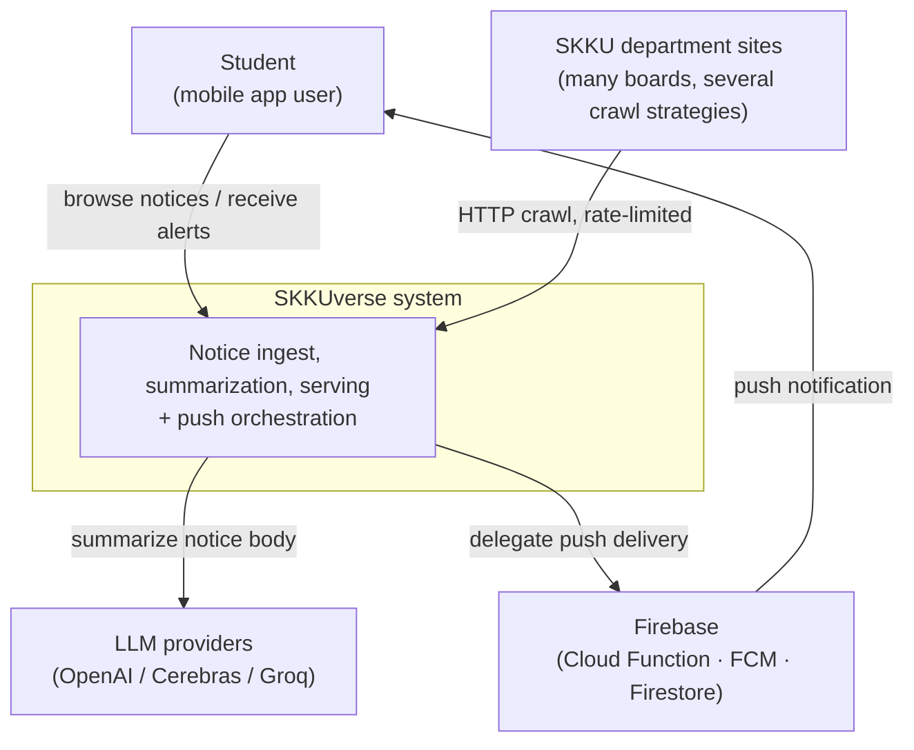

# System Context

> SKKUverse's system boundary — who uses it, and which parts of the outside world it depends on (C4 Level 1). One level in: [Container View](container-view.md).

## Context

SKKUverse is a campus app for Sungkyunkwan University students. Its core value is **gathering department notices scattered across dozens of sites into one place and structuring them with AI**. That shapes the boundary: the system touches two kinds of outside world — **the sources it scrapes** (SKKU department sites) and **the channel it pushes results through** (FCM).

## Diagram

## What the boundary means

| External system | Relationship | Why it sits outside |
| --- | --- | --- |
| SKKU department sites | Crawl target (read) | Not under our control. Every board is built differently, and that variation is absorbed by a set of crawl strategies — see [crawler docs](https://github.com/spencer0124/skkuverse-crawler/tree/main/docs) |
| LLM providers | Summarization delegated (synchronous HTTP) | Cost and availability risk. A `litellm` Router gives three-way fallback → [Notice Pipeline](../flows/notice-pipeline.md) |
| Firebase | Push delivery delegated | Token storage and fan-out offloaded to a Cloud Function, isolating the VM from that load and cost |

The source list and the strategy set are both owned by `skkuverse-crawler` — `sources.json` is the SSOT. This document deliberately does not restate their counts; see [docs/README.md §3](../README.md).

**The load-bearing storage choice**: user data lives in Firebase (Firestore/Auth), public data (notices, buildings, buses) in MongoDB. The line between them is *whose data is this*. Detail in [Data Topology](data-topology.md).

## Related

- [Container View](container-view.md) — inside the boundary, at repo and datastore granularity
- [Notice Pipeline](../flows/notice-pipeline.md) — these touchpoints as an actual sequence
