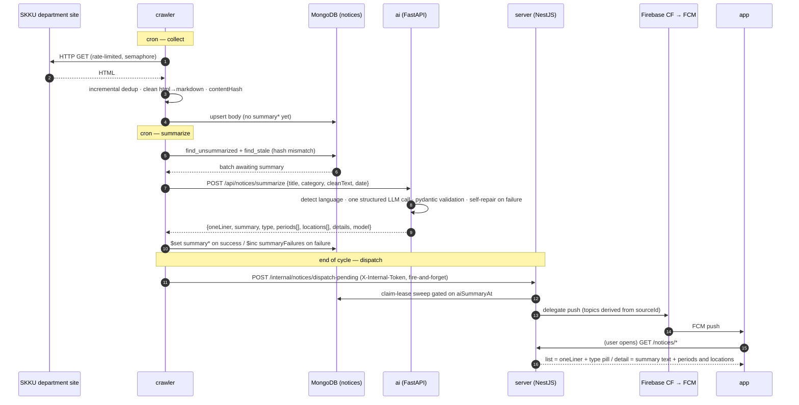

# Notice Pipeline (End-to-End)

> The full path of the AI notice feature — from crawling a department site to rendering on screen, as one route across six repos. The static structure is in [Container View](../architecture/container-view.md); data ownership in [Data Topology](../architecture/data-topology.md).

## In one sentence

**The crawler collects and cleans a notice into Mongo → the AI service attaches a structured summary in a single LLM call → the server reads it, serves it, and orchestrates the push → the app renders it. No message queue: Mongo is the bus, and there are exactly two synchronous HTTP seams.**

## Sequence

## Who owns which segment

| Segment | Repo | What it does | Detail |
| --- | --- | --- | --- |
| Collect and clean | **crawler** | Per-site crawl strategies, incremental dedup, html→markdown, `contentHash` | [crawler docs](https://github.com/spencer0124/skkuverse-crawler/tree/main/docs) |
| Storage schema | **crawler** | The `notices` document and the `summary*` field family (SSOT) | [crawler `docs/notice-schema.md`](https://github.com/spencer0124/skkuverse-crawler/blob/main/docs/notice-schema.md) |
| Summarize and classify | **ai** | One structured LLM call, three-way type classification, litellm fallback, never returns 500 | [ai docs](https://github.com/spencer0124/skkuverse-ai/tree/main/docs) *(a dedicated summarization design doc is still pending)* |
| Serve and dispatch | **server** | Read API, read index, claim-lease push sweep | [server `docs/reference/notices-api.md`](https://github.com/spencer0124/skkuverse-server/blob/main/docs/reference/notices-api.md) |
| Render and deliver | **app** | Server-driven tabs, Markdown rendering, FCM receipt | [app docs](https://github.com/spencer0124/skkuverse-app/tree/main/docs) |

The tab configuration that drives the first and last rows is itself a cross-repo contract — the crawler owns it, the server vendors it, and the app's Cloud Function mirrors the tab keys. See [Config Contracts](../../contracts/README.md).

## Three design points

1. **Summaries attach asynchronously (the `summaryAt` null gate).** Crawling never waits on summarization. The body is stored first and the summary catches up later; the app shows "summary pending" while `summaryAt` is null.
2. **Two timestamps, deliberately (`summaryAt` vs `aiSummaryAt`).** One is the crawler's internal "summarized" marker, the other is the server's FCM dispatch gate. Keeping them separate is what stops a re-summarization from triggering a second push.
3. **What the three-way `type` is for.** `action_required | event | informational` is used downstream **only to interpret deadlines**. Subject classification (department, scholarship, …) is the crawler's `category` metadata, a different axis entirely.

> [!NOTE]
> Concrete values — field counts, field names, cron expressions — are owned by each repo's code. This document describes the shape of the flow; look up the values in the linked documents.

## Related

- [System Context](../architecture/system-context.md)
- [Container View](../architecture/container-view.md)
- [Data Topology](../architecture/data-topology.md)
- [ADR 0001 — Notice data ownership](../decisions/0001-notice-data-ownership.md)
