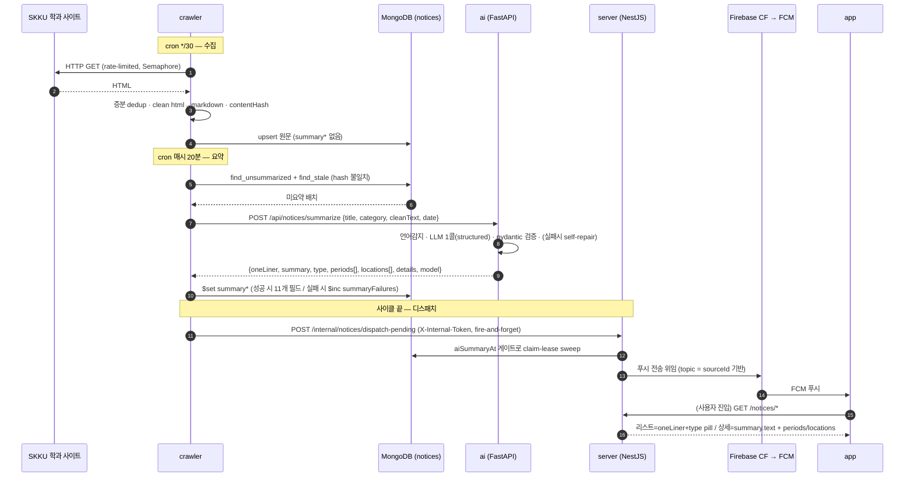

# Notice Pipeline (End-to-End)

> AI 공지 기능의 전체 흐름 — 학과 사이트 크롤링부터 앱 화면 렌더까지, 6개 레포를 가로지르는 하나의 경로. 정적 구조는 [컨테이너 뷰](../architecture/container-view.md), 데이터 소유는 [데이터 토폴로지](../architecture/data-topology.md).

## 한 문장

**"공지 원문을 크롤러가 수집·정제해 Mongo에 쓰고 → AI가 LLM 1콜로 구조화 요약을 붙이고 → 서버가 읽어 서빙하며 푸시를 오케스트레이션하고 → 앱이 렌더한다. 메시지 큐 없이 Mongo를 버스로, 동기 HTTP 시임은 딱 2개."**

## 시퀀스

## 레포별 담당 구간

| 구간 | 레포 | 무엇을 하나 | 상세 문서 |
| --- | --- | --- | --- |
| 수집·정제 | **crawler** | 크롤 전략 9종, 증분 dedup, html→markdown, `contentHash` | [crawler docs](https://github.com/spencer0124/skkuverse-crawler/tree/main/docs) |
| 저장 스키마 | **crawler** | `notices` 문서 + `summary*` 11개 필드 (SSOT) | [crawler `reference/schema/notices.md`](https://github.com/spencer0124/skkuverse-crawler/tree/main/docs) |
| 요약·분류 | **ai** | LLM 1콜 구조화 추출, 3-type 분류, litellm 3중 fallback, "절대 500 안 냄" | [ai `explanation/notice-summarization.md`](https://github.com/spencer0124/skkuverse-ai/tree/main/docs) *(신설 예정)* |
| 서빙·디스패치 | **server** | 읽기 API, 읽기 인덱스, claim-lease 푸시 sweep | [server `reference/notices-api.md`](https://github.com/spencer0124/skkuverse-server/tree/main/docs) |
| 렌더·전달 | **app** | 서버 주도 탭, 마크다운 렌더, FCM 수신 | [app `explanation/notices-feature.md`](https://github.com/spencer0124/skkuverse-app/tree/main/docs) |

## 설계 포인트 3가지

1. **비동기 요약 (`summaryAt` null 게이트)**: 크롤은 요약을 기다리지 않는다. 원문을 먼저 저장하고, 요약은 나중에 "붙는다". 앱은 `summaryAt: null`이면 "요약 준비 중"을 보여준다.
2. **이중 타임스탬프 (`summaryAt` vs `aiSummaryAt`)**: 하나는 크롤러 내부 "요약됨" 마커, 하나는 서버 FCM 디스패치 게이트 — 의도적으로 분리해 재요약이 재푸시를 유발하지 않게 한다.
3. **`type` 3분류의 용도**: `action_required | event | informational`은 downstream에서 **"마감 의미 해석"** 에만 쓰인다 (학과/장학 같은 분류는 크롤러 `category` 메타 담당). 근거는 [ai 요약 설계 문서](https://github.com/spencer0124/skkuverse-ai/tree/main/docs).

> [!NOTE]
> 필드 개수·이름·크론 표현식 등 구체 값은 각 소유 레포의 코드가 SSOT다. 이 문서는 흐름의 형태를 설명하고, 값은 링크된 문서에서 확인한다.

## 관련 문서

- [시스템 컨텍스트](../architecture/system-context.md)
- [컨테이너 뷰](../architecture/container-view.md)
- [데이터 토폴로지](../architecture/data-topology.md)
- [ADR 0001 — 공지 데이터 소유권](../decisions/0001-notice-data-ownership.md)
